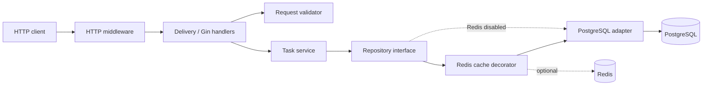

# Task Manager

A production-minded Task Manager REST API written in Go for the GRAPH backend
engineering challenge.

## Table of contents

- [Overview](#overview)
- [Architecture](#architecture)
- [Running with Docker](#running-with-docker)
- [Configuration](#configuration)
- [API reference](#api-reference)
- [API documentation](#api-documentation)
- [Caching](#caching)
- [Running the tests](#running-the-tests)
- [Observability](#observability)
- [Load testing and profiling](#load-testing-and-profiling)
- [Migrations](#migrations)
- [Trade-offs and limitations](#trade-offs-and-limitations)

## Overview

The service provides create, read, list, partial-update and soft-delete operations
for tasks. It uses Gin for HTTP delivery, PostgreSQL through pgx for persistence,
and an optional Redis cache-aside decorator. It also includes cursor pagination,
status and assignee filters, Swagger documentation, Prometheus metrics,
request-correlated JSON logging, graceful shutdown, integration tests, a k6 load
scenario and opt-in pprof endpoints.

Task statuses are `pending`, `in_progress` and `done`.

## Architecture



The dependency direction follows the interface/adapter approach:

- `delivery/httpserver` owns HTTP concerns: routing, binding, status codes,
  middleware and response serialization.
- `validator/taskvalidator` validates transport parameters without knowing about
  HTTP or persistence.
- `service/taskservice` contains application behavior and declares the
  `Repository` interface it consumes.
- `repository/postgres/postgrestask` implements that interface with pgx.
- `repository/redis/redistask` implements the same interface as a decorator and
  delegates cache misses and all writes to the wrapped repository.
- `entity` contains dependency-free domain types and error classes; `param`
  contains service request and response shapes.
- `cmd/api` is the composition root. It selects concrete adapters and injects
  them into the layers above.

This keeps the application service independent of Gin, pgx, Redis and the
concrete logging implementation. Replacing one of those adapters is localized
to its package and the composition root.

## Running with Docker

```sh
docker compose up --build -d
docker compose exec api /migrate up
curl http://localhost:8080/healthz
```

That brings up `postgres`, `redis` and `api` on port 8080; the API waits for both
data stores to report healthy before it starts. Migrations stay a deliberate,
separate step — never run on API startup, and no migration container runs behind
your back on `up` — so apply them once with the second command. It runs the
`/migrate` binary that the same image already carries, inside the API container,
so it reuses the API's `DATABASE_URL` and reaches Postgres by its compose
hostname. (`exec` needs no shell in the image: Docker runs the binary directly.)
`go run ./cmd/migrate up` from the host does the same job against
`localhost:5432`.

The image is multi-stage: `golang:1.26-alpine` builds static binaries, and the
final stage is `gcr.io/distroless/static-debian12:nonroot` — no shell, no package
manager, running as an unprivileged user. Because there is no shell, the API's
compose healthcheck cannot be a `wget`/`curl` one-liner; a third tiny binary,
`/healthcheck`, ships in the image and exits non-zero unless `/healthz` answers
200.

Rebuild after a code change with `docker compose up --build -d api`, and tear the
stack down with `docker compose down` (add `-v` to drop the database volume too).

## Configuration

Configuration is read from the process environment. For local runs, variables
can also be loaded from `.env`; copy [`.env.example`](.env.example) as a starting
point. Existing environment variables take precedence over values in that file.

| Variable | Default | Description |
| --- | --- | --- |
| `ENV_FILE` | `.env` | Optional dotenv file to load. |
| `APP_MODE` | `development` | One of `development`, `production` or `test`. |
| `HTTP_PORT` | `8080` | Public HTTP server port. |
| `DATABASE_URL` | required | PostgreSQL connection URL. |
| `REDIS_URL` | empty | Redis connection URL; an empty value disables caching. |
| `REDIS_TTL` | `1m` | Cache lifetime as a Go duration, such as `60s` or `5m`. |
| `PPROF_ENABLED` | `false` | Starts the private profiling server when true. |
| `PPROF_PORT` | `6060` | Profiling port; it must differ from `HTTP_PORT`. |

To run the API directly after starting PostgreSQL and applying migrations:

```sh
cp .env.example .env
go run ./cmd/api
```

## API reference

The task API is rooted at `http://localhost:8080/api/v1`. All request and
response bodies are JSON. A task has this shape:

```json
{
  "id": 42,
  "title": "Document the API",
  "description": "Add examples to the README",
  "status": "in_progress",
  "assignee": "alex"
}
```

| Field | Rules |
| --- | --- |
| `title` | Required when creating; 1–200 characters. |
| `description` | Optional; at most 2,000 characters. |
| `status` | `pending`, `in_progress` or `done`; defaults to `pending` when creating. |
| `assignee` | Optional; at most 100 characters. |

| Method | Path | Description |
| --- | --- | --- |
| `POST` | `/api/v1/tasks` | Create a task. |
| `GET` | `/api/v1/tasks/:id` | Get one non-deleted task. |
| `GET` | `/api/v1/tasks` | List tasks with cursor pagination and optional filters. |
| `PATCH` | `/api/v1/tasks/:id` | Update only the supplied fields. |
| `DELETE` | `/api/v1/tasks/:id` | Soft-delete a task. |
| `GET` | `/healthz` | Service health check. |
| `GET` | `/metrics` | Prometheus exposition endpoint. |

### Create a task

```sh
curl -i -X POST http://localhost:8080/api/v1/tasks \
  -H 'Content-Type: application/json' \
  -d '{
    "title": "Document the API",
    "description": "Add examples to the README",
    "assignee": "alex"
  }'
```

The response is `201 Created`; an omitted status becomes `pending`:

```json
{
  "task": {
    "id": 42,
    "title": "Document the API",
    "description": "Add examples to the README",
    "status": "pending",
    "assignee": "alex"
  }
}
```

### Get a task

Replace `42` in these examples with an ID returned by the create endpoint.

```sh
curl http://localhost:8080/api/v1/tasks/42
```

The response is `200 OK` and uses the same `{"task": {...}}` envelope as the
create endpoint.

### List and filter tasks

```sh
curl 'http://localhost:8080/api/v1/tasks?status=pending&assignee=alex&limit=20'
```

Results are ordered by descending ID. `limit` defaults to 20 and values above 50
are clamped to 50. When `has_more` is true, pass `next_cursor` as the next
request's `cursor`:

```json
{
  "tasks": [
    {
      "id": 42,
      "title": "Document the API",
      "description": "Add examples to the README",
      "status": "pending",
      "assignee": "alex"
    }
  ],
  "next_cursor": 42,
  "has_more": true
}
```

```sh
curl 'http://localhost:8080/api/v1/tasks?status=pending&assignee=alex&limit=20&cursor=42'
```

`next_cursor` is `0` when there is no next page.

### Partially update a task

PATCH distinguishes an omitted field from a supplied field. Only fields present
in the body are changed; at least one field must be supplied.

```sh
curl -i -X PATCH http://localhost:8080/api/v1/tasks/42 \
  -H 'Content-Type: application/json' \
  -d '{"status":"done","assignee":"sam"}'
```

The response is `200 OK` with the updated task in the `task` envelope.

### Delete a task

```sh
curl -i -X DELETE http://localhost:8080/api/v1/tasks/42
```

The response is `204 No Content`. Deletion is soft: the row remains in
PostgreSQL with `deleted_at` set, but subsequent get, update and delete requests
treat it as missing and list requests exclude it.

### Error responses

Invalid input returns `400 Bad Request`. Field-level validation errors use a
stable envelope:

```json
{
  "message": "invalid input",
  "errors": {
    "title": "title is required",
    "status": "status must be one of: pending, in_progress, done"
  }
}
```

Malformed JSON returns `{"message":"request body is not valid JSON"}`, an
unknown or deleted task returns `404` with `{"message":"task not found"}`, and
unexpected failures return `500` with `{"message":"internal server error"}`.
Internal error details are logged and are not exposed to clients.

## API documentation

With the API running, Swagger UI is available at:

```text
http://localhost:8080/swagger/index.html
```

The machine-readable Swagger 2.0 specification is served at
`http://localhost:8080/swagger/doc.json`. Generated copies are committed as
`docs/swagger/swagger.json` and `docs/swagger/swagger.yaml`, so the API contract
can also be read without running the service.

After changing an endpoint, request type or response type, regenerate all three
documentation artifacts with:

```sh
make generate-docs
```

## Caching

`GET /tasks/:id` and `GET /tasks` are served through a cache-aside layer in
`internal/repository/redis/redistask`. It is a decorator implementing the same
`taskservice.Repository` interface as the Postgres adapter and wrapping it, so no
layer above the repository knows caching exists — it is composed in `main.go` and
nowhere else. Set `REDIS_URL` to enable it; leave it empty and the API talks
straight to Postgres.

A standalone Persian explanation of the list invalidation design is available in
[`docs/redis-list-cache-invalidation-fa.md`](docs/redis-list-cache-invalidation-fa.md).

Single tasks are trivial to invalidate: one key per id (`task:{id}`), dropped on
that id's update or delete.

Lists are the hard case. Every status/assignee/cursor/limit combination is its own
key, and given "task 42 changed" there is no way to ask Redis which of those keys
are affected — the payloads are opaque to it, and membership *after* a write isn't
derivable from membership *before* it (flip a task from `pending` to `done` and it
must leave every `status=pending` page **and** join `status=done` pages it was
never in). Scanning the keyspace on every write is O(keyspace); a reverse index of
"which pages contain task 42" needs one index per filter dimension, each with its
own TTL bookkeeping, and a bug in it serves silently wrong data indefinitely.

So this implementation doesn't look for the keys — it **orphans** them. Each page
key carries an opaque generation token read from `tasks:list:gen`:

```
tasks:list:{gen}:{status}:{assignee}:{cursor}:{limit}
```

Any write replaces that token with a fresh cryptographically random value.
Nothing is enumerated and nothing is deleted; old keys simply become unreachable
because no later read constructs a key with a previous token. They fall out on
their own TTL.

Every key expires. Pages live for `REDIS_TTL` (default 60s), while the generation
token lives ten times that. If Redis evicts the token first under `allkeys-lru`,
the next list read atomically creates a fresh random token rather than resetting
to a reusable value, so an abandoned page cannot become reachable again.

Every cache operation is best-effort: a Redis error makes a read fall through to
Postgres and a write proceed anyway, because a cache must never be able to take
the API down. Failures are emitted as structured warning logs with their request
ID and cache operation. Invalidation runs on `context.WithoutCancel`, so a client
that disconnects the instant after its write still gets its stale entries
dropped.

The non-deleted task count is cached separately as `tasks:count`. On a miss, the
Redis decorator acquires a short-lived `SET NX` lock, checks the key again, reads
PostgreSQL once and stores the result with a TTL. Successful creates and deletes
take the same lock and invalidate the cached count. The next background refresh
then rebuilds it from PostgreSQL instead of trying to adjust a value whose
initialization may have overlapped the committed write. A token-checked Lua
release prevents one lock owner from releasing another owner's
expired-and-reacquired lock.

### When this is the wrong design

Retiring every page on every write is deliberate over-invalidation, so the list
cache is worth exactly the repeat reads that land between two consecutive writes:

- **Read-heavy** — a board polling `GET /tasks` every few seconds against a
  handful of writes a minute. A generation survives tens of seconds and serves
  hundreds of reads. Clear win.
- **Write-heavy** — writes arriving about as often as reads. The hit rate
  collapses toward zero while every request still pays `GET gen` + `GET page` +
  `SET page`. Strictly worse than no cache at all.

This service assumes the first. If that stopped holding, the two ways out are
**TTL-only caching with no invalidation** (accept 5–10s of staleness, drop the
counter entirely, and write rate stops mattering — what most listing endpoints
actually do) or **per-filter generations** (`tasks:list:gen:{status}:{assignee}`),
which keeps the hit rate up under writes but has to bump the counters for both the
task's old and new status/assignee, so an update must read the task first.

## Running the tests

Unit tests need nothing but Go:

```sh
make test-unit
```

Integration tests run against a real Postgres and a real Redis, both kept
**separate** from the development ones — a `task_manager_test` database, because
they apply migrations and delete rows, and Redis index 15, because they flush it.
Start both, create that database once, then run them:

```sh
docker compose up -d --wait postgres redis
docker compose exec -T postgres createdb -U postgres task_manager_test
make test-integration
```

The `createdb` step is a one-off per volume — the database persists in the
`postgres-data` volume, so it is only needed on a fresh checkout or after
`docker compose down -v`. If it already exists, `createdb` prints
`database "task_manager_test" already exists` and nothing is harmed.

Connection details come from `.env.test`, which `make test-integration` passes as
an absolute `ENV_FILE` (`go test` runs each package from its own directory, so a
relative `.env` lookup would miss the repo root). The tests refuse to run unless
the database name ends in `_test` and the Redis index is not 0, so a mis-set
`ENV_FILE` fails loudly instead of migrating the development database or flushing
the development cache.

For combined unit + integration coverage as a single merged figure:

```sh
make coverage
```

## Observability

Prometheus metrics are exposed at `GET /metrics`. Request counters, latency
histograms and `tasks_count` are served from process memory, so scraping metrics
does not execute a database query. A background worker refreshes `tasks_count`
every 15 seconds through the repository interface and retains the last successful
value when a refresh fails. With Redis enabled, that repository count is served
from the cached counter described above; a cache miss falls back to PostgreSQL.

```sh
curl http://localhost:8080/metrics
```

The application writes structured JSON logs through a context-aware logger
interface backed by `log/slog`. HTTP middleware accepts or creates an
`X-Request-ID`, returns it to the caller, and propagates it through the request
context so handler and cache logs carry the same `request_id` field.

```sh
curl -i -H 'X-Request-ID: demo-42' http://localhost:8080/healthz
```

This is log correlation rather than full distributed tracing: it does not
create spans, propagate W3C trace context or export data to a tracing backend.

## Load testing and profiling

The k6 scenario in `loadtest/k6/tasks_load_test.js` ramps from 0 to 30 virtual
users and back down over one minute. It exercises list and filtered-list reads,
single-task reads, creates, partial updates and deletes. Tasks are tagged with a
run-specific assignee and removed during teardown. The run fails if request or
application-check errors reach 1%, or if overall p95 latency reaches 500 ms.

Run it against an already-migrated stack:

```sh
make load-test
# Or target another deployment:
make load-test BASE_URL=https://tasks.example.com
```

Profiling is disabled by default. Enable it only for a profiling run:

```sh
PPROF_ENABLED=true docker compose up --build -d api
```

pprof has its own server and mux on port 6060; it is not mounted on the public
Gin router. Compose binds that port to `127.0.0.1`, so it cannot be reached on an
external interface. Capture a profile in one terminal while k6 runs in another:

```sh
make pprof-cpu
make pprof-heap
go tool pprof -top .tmp/profiles/cpu.pb.gz
go tool pprof -http=:0 .tmp/profiles/heap.pb.gz
```

`PPROF_PORT` changes the internal listener port when running the binary directly.
If it changes under Compose, update the loopback port mapping to match. Do not
publish this listener in a production deployment; pprof data can reveal process
and workload details.

### Baseline result

The one-minute scenario was run locally on 24 September 2026 with the API on the
host and Postgres and Redis in Compose. These numbers are a development-machine
baseline, not a production capacity claim:

| Measurement | Result |
| --- | ---: |
| HTTP requests | 10,820 |
| Throughput | 174.48 requests/s |
| p95 latency | 4.23 ms |
| Median latency | 0.64 ms |
| HTTP/check failure rate | 0% |

The simultaneous 60-second CPU profile contained 2.59 CPU-seconds of samples,
or 4.32% of one core. Linux syscalls were the largest flat entry at 26.25% and
runtime futex waits were next at 9.27%. The list handler accounted for 27.03%
cumulatively, with the Postgres list adapter at 14.67%; cumulative values overlap
their callees and are not additive. JSON response writing was 10.42% cumulative.
No application function was a significant flat CPU hotspot, so the useful
conclusion at this load is that the service is lightly CPU-utilized and spends
most sampled time in network/database I/O and runtime scheduling. Optimizing
handler code from this profile would be premature; a higher-throughput or
database-constrained run is the next useful experiment.

The post-run heap profile reported about 5.23 MiB in use. Profiling/runtime
buffers accounted for about 2.72 MiB, and the largest application-linked entry
was pgx's prepared-statement cache at about 512 KiB. It showed no evidence of
unbounded task retention in this bounded run. A longer soak test with several
heap snapshots would be required before making a memory-leak claim.

## Migrations

Migrations are applied deliberately, never on API startup:

```sh
go run ./cmd/migrate up       # apply everything pending
go run ./cmd/migrate down     # roll back the most recent migration
go run ./cmd/migrate version  # print the applied version
```

The SQL is embedded in the binary, so the command is self-contained. It reads
`DATABASE_URL` from `.env` or the environment; `-database` overrides it.

## Trade-offs and limitations

| Decision | Consequence |
| --- | --- |
| Consumer-owned repository interface | The service defines only the persistence operations it needs. PostgreSQL and Redis remain replaceable adapters, at the cost of a little explicit wiring in `cmd/api`. |
| pgx without an ORM | SQL and query behavior stay visible and controllable, but schema/query changes are maintained manually rather than generated from models. |
| Hand-written validation | The current rule set stays small and dependency-free. A larger set of reusable or database-backed rules would justify a validation library. |
| Manual embedded migrations | Every environment runs the same migration files, and API replicas do not race during startup. Deployment must deliberately run `/migrate up`. Applied migration files must remain immutable. |
| Soft deletion | Deleted tasks disappear from API operations and metrics without destroying data. A production system would need a retention or purge job to prevent indefinite table growth. |
| String-backed status column | Adding a new status requires an application change rather than a PostgreSQL enum migration. Direct database writes can bypass application validation. |
| No audit timestamps in API responses | `created_at`, `updated_at` and `deleted_at` remain persistence details, keeping the domain/API small but making them unavailable to clients. |
| Generation-based list cache invalidation | Replacing one Redis token invalidates every cached page safely, but over-invalidates unrelated filters and performs poorly for write-heavy workloads. |
| Background-refreshed task gauge | Prometheus scrapes never query PostgreSQL, and the last successful value survives a temporary refresh failure. The metric can lag the source of truth by up to the 15-second refresh interval. |
| Request-ID correlation | Logs for one request can be located without operating a tracing backend. This is not distributed tracing and provides no spans, sampling or cross-service propagation. |

Authentication and authorization are intentionally out of scope for this
challenge. The service also permits any transition between valid task statuses;
a workflow that requires `pending → in_progress → done` should enforce that
state machine in the service layer. Rate limiting, request-size limits and a
hard-delete retention process would also be required before exposing the API to
untrusted production traffic.
